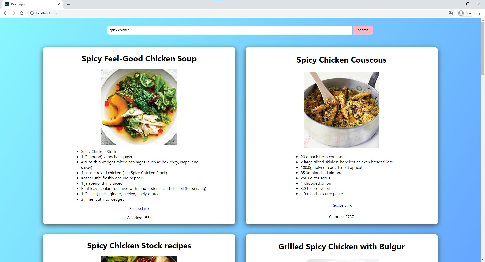

# React.js projects
This repository consists of small-scale projects listed below in reverse chronological order.


# Instagram-like social website

Instagram-like social website that allows users to post photos of memories alongside of short description.

folder: [mern-memories](mern-memories)  
live site: [https://dp-memories.netlify.app/](https://dp-memories.netlify.app/)

Key features:
- MERN stack: React <--> Node + Express <--> MongoDb Atlas,
- Google Oauth + JWT token authentication and authorization for protected routes,
- Bcrypt encrypted password storage in cloud database,
- Local Storage and Redux for frontend global state,
- MaterialUI with focus on mobile responsiveness,
- Backend hosted on Heroku, frontend on Netflify. Both with continous integration.


Main page for non-users | Auth page
:-------------------------:|:-------------------------:
  |  

Logged in
:-------------------------:


---

## Travelling salesman solver

folder: [d3-with-react](d3-with-react)  
video: [https://youtu.be/5adG-dDsgVE](https://youtu.be/5adG-dDsgVE)

React component that visualizes the process of solving Travelling Salesman problem.

Key features:
- Data-View binding,
- Fluent transitions on data change,
- JS generator functions for continuous progress update,
- MaterialUI buttons.

Random locations | Random path
:-------------------------:|:-------------------------:
  |  

Solved
:-------------------------:


---

# Article publishing platform

folder: [blog-app](blog-app)  
video: https://www.youtube.com/watch?v=0el1uCRgTac

Simple article publishing platform made with React and json-server as fake backend


Main page
:-------------------------:


Adding article           |  Article view 
:-------------------------:|:-------------------------:
  |  

---

# HTML+CSS

folder: [just-html-css](just-html-css)

A static website written in pure HTML and CSS


:-------------------------:

 |  
:-------------------------:|:-------------------------:

---

# routing-app

folder: [routing-app](routing-app)

Browse latest Fortnite items using free Fotnite API

  |  
:-------------------------:|:-------------------------:

---

# recipe-app

folder: [recipe-app](recipe-app)  
video: https://youtu.be/szyZMtJvSOk

Recipe finder with Edamam API.

  |  
:-------------------------:|:-------------------------:

---

```
console.log('%c✉'+[...`🍔🍑🍧🍙🍔🍠🍙🍕🍓🍘🍟🍤🍑🎤🎢🌰🍗🍝🍑🍙🍜🐼🍓🍟🍝`].map(a=>String.fromCodePoint(a.charCodeAt(1)%123)).join(''),"font:2em system-ui;");
```
